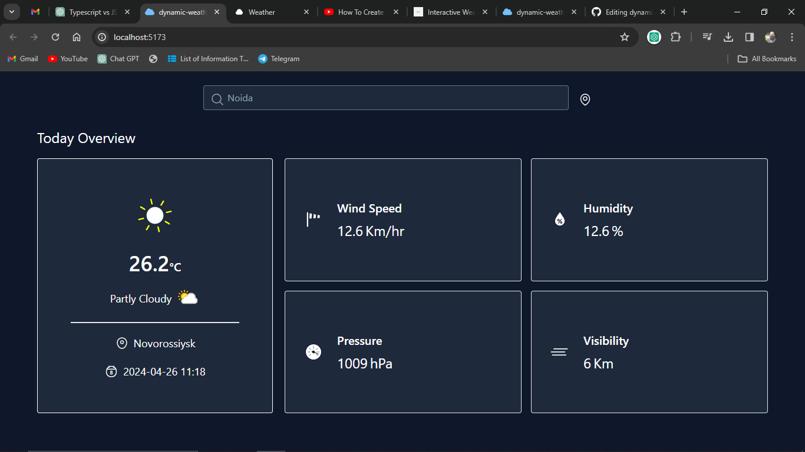

---

# Dynamic Weather Dashboard

## Description
The Dynamic Weather Dashboard is an interactive web application that allows users to track real-time weather data for multiple locations. Users can add and remove cities to their dashboard, view detailed weather information, and enjoy a visually appealing and user-friendly experience.

## Table of Contents
- [Installation](#installation)
- [Usage](#usage)
- [Features](#features)
- [Technologies](#technologies)
- [Contributing](#contributing)
- [License](#license)

## Installation
To run the Dynamic Weather Dashboard locally, follow these steps:

1. Clone the repository:
   ```bash
   git clone https://github.com/yourusername/dynamic-weather-dashboard.git
   ```
2. Navigate to the project directory:
   ```bash
   cd dynamic-weather-dashboard
   ```
3. Install dependencies:
   ```bash
   npm install
   ```

## Usage
After installation, you can start the development server using:
```bash
npm start
```
This will launch the Dynamic Weather Dashboard in your default web browser.

## Features
- **Real-time Weather Data:** Fetches weather data from a public API to provide up-to-date information.
- **User-friendly Interface:** Sleek and modern design with an intuitive user interface.
- **City Tracking:** Allows users to add and remove cities to track their weather conditions.
- **Responsive Design:** Provides a seamless experience on both desktop and mobile devices.
- **Weather Information:** Displays temperature, humidity, wind speed, and weather icons for each city.

## Technologies
- React
- CSS (for styling)
- OpenWeatherMap API (or other weather API)
- Icons 

## Contributing
We welcome contributions from the community to enhance the Dynamic Weather Dashboard. If you'd like to contribute, please follow these steps:

1. Fork the repository.
2. Create a new branch (`git checkout -b feature-branch`).
3. Make your changes and commit them (`git commit -am 'Add new feature'`).
4. Push to the branch (`git push origin feature-branch`).
5. Create a new Pull Request.


## Screenshots




---

